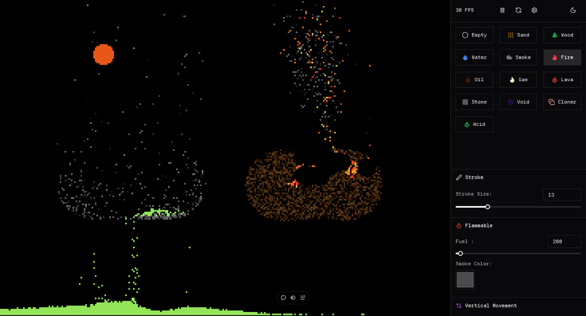

# Particle Garden


<!--  -->

Hello and welcome to Particle Garden, a falling sand style simulator created using TypeScript, React and Three.js

## Preview



## Features

- ✅ **Customizable Materials and Behaviour**: allows for fine grained custom physics
- ✅ **TypeScript**: Ensures type safety across the entire project

## Getting Started

### Installation

1. Clone the repository:
   ```sh
   git clone https://github.com/kabirsync/particlegarden.git
   cd particlegarden
   ```
2. Install dependencies:
   ```sh
   pnpm install
   ```

### Development

Run all apps:

```sh
pnpm run dev
```

### Building

Build web & backend apps:

```sh
pnpm run build
```

Build desktop app:

```sh
pnpm --filter desktop build:linux
pnpm --filter desktop build:win
pnpm --filter desktop build:mac
```
